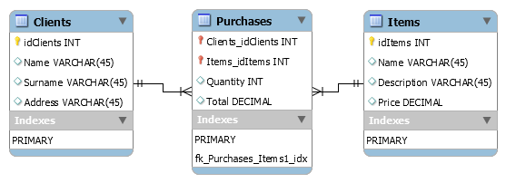

<!-- README.md is generated from README.Rmd. Please edit that file -->


<!-- start badges -->


<a href="https://mybinder.org/v2/gh/HEADS-UPorto/Rstudio_Env/main?urlpath=git-pull%3Frepo%3Dhttps%253A%252F%252Fgithub.com%252FHEADS-UPorto%252F${REPOSITORY_SLUG}%26targetPath%3Dheads%26urlpath%3Drstudio%252F%26branch%3Dmaster"></a>


<!-- end badges -->

Syllabus
--------

This module will cover:

-   Introduction to SQL
-   Parallel between `dplyr` and SQL

Lessons
-------

### Module 5.1: Introduction to SQL

#### What is SQL?

SQL stands for Structured Query Language. It became an ANSI standard in
1986 and an ISO standard in 1987, so it’s pretty old and deserves
respect.

SQL is more than a way to access and manipulate databases; it is **the
way** to talk to [relational
databases](https://en.wikipedia.org/wiki/Relational_database). There are
several *systems* that *manage* relational databases; they are called
(surprise!) Relational DataBase Management Systems (RDBMS). Some
examples you may had heard about:

-   [MySQL](https://www.mysql.com/): This is by far the most popular
    open-source SQL database (has been around since 1995). Its main
    advantages used to be its ease to use, low cost, and reliability in
    addition to a large community. Its main downside was a poor
    performance when scaling. Oracle took control of MySQL in 2012;
    since then, the open-source development has slowed. The original
    development of MySQL was continued with the name of
    [MariaDB](https://mariadb.org/).
-   [PostgreSQL](https://www.postgresql.org/): This is another
    open-source SQL database that is not controlled by any corporation.
    Its main usage is for web applications. Its main disadvantage was
    performance compared to MySQL, but it has some additional features.
    Nowadays, both MySQL and PostgreSQL have improved their weakness,
    being both good choices. Still in 2020 MySQL has much more
    [popularity](https://www.statista.com/statistics/809750/worldwide-popularity-ranking-database-management-systems/).
-   [Oracle DB](https://www.oracle.com/database/): Is the most used
    database [in
    2020](https://www.statista.com/statistics/809750/worldwide-popularity-ranking-database-management-systems/).
    Used by banks, hospitals, and big enterprises. It is very reliable
    and scalable, but it can be quite expensive since it is not free
    software (neither open source).
-   [SQL
    Server](https://www.microsoft.com/en-us/sql-server/sql-server-2017):
    It’s Microsoft’s response to Oracle DB. It is popular in
    medium-large enterprises. Microsoft offers a free level called SQL
    Server Express but can also become expensive as you scale your
    database.
-   [SQLite](https://www.sqlite.org/): It is a popular open-source SQL
    database that is self-contained in a single file. It does not
    depends on a Server and is a popular choice for small electronics.

#### What can SQL do?

SQL can do almost all tasks to create and manage a database, like:
create new databases, create and delete tables, insert, update and
delete records, create *views*, store routines, and for administrators,
can create and manage users, set permissions and access levels.

#### What means *Relational* in Relational Databases?

“Relational” means that a table is not alone (most of the time).
Usually, a database comprises several tables with interrelations like a
table that stores the clients and a table that stores the items for
selling. Another table stores the purchases, where one of the columns
(variables) is the client’s unique ID, and another is the item’s unique
ID, for example. Check the visual example below:



Here you see that the middle table has one variable called
`Clients_idClients` that stores the information from table Clients, and
`Items_idItems` stores information from table Items. This makes the
**Relation** between them.

> Not in the scope of this introduction, the relations you see above are
> called `1:N` or if you abstract the middle table, `N:M`. This means
> that `1` client can have multiple purchases, or `1` item can be sold
> in several purchases. Or, in the abstraction thought, many clients can
> buy many items.

This **relations** make the database at the same time quicker for
querying and enforces its integrity. You may ask how integrity can be
enforced here? Let’s think of some scenarios and verify if it is true or
false:

-   Table Purchases can only store id’s that already exists. If the
    application tries to store an id that does not exist, the server
    throws an error.
-   If I delete an item, all purchases that had that item are also
    deleted.
-   If I delete a purchase, both the client and the item stored in that
    purchase are deleted.
-   If I need to change one client’s address, I need to change the
    address on all previous purchases.

The answer is: it depends on how you program the relations. The false
scenarios are the last two. And the first one is always desirable to be
true.

This way of storing the information (in multiple tables) avoids the need
for duplicating information, and when you query the information, you
ensure that it is up to date. As the last scenario above, if I change
one client’s address, I change this information only on table Clients.
When I query any other table related to this client, I receive the
current address.

#### Indexing

As we have learned, the relations are made between two tables using a
common variable on both tables. In the origin table (Clients), this
variable is called the Primary Key (PK). In the other table, this
variable is called Foreign Key (FK).

These variables are indexed, meaning that the database system keeps an
optimized index of their values, which substantially accelerates the
query.

Tables can have multiple indexes, but only **one** PK. This is a special
index that cannot have duplicate values and cannot have missing values.
That is why we usually chose as PK a variable that uniquely identifies
the entries.

When we have a query that we know it will be used frequently, we can
improve its speed using indexes on the variables we use to join the
tables.

#### Joins

Imagine the tables Clients and Purchases again. What if we want to work
on a single table that merges all the information? As we have seen, one
client can have multiple purchases, so how would it look like if we join
these two tables using the `idClients` as the joining variable?

The answer is: we will have a table with all variables from Clients and
Purchases (except the FK `Clients_idClients`), and the Client entries
will be duplicated if there is more than one purchase by that client.

Joins are how we can combine multiple tables to get just the information
we need.

#### Queries

This lesson will not cover this topic deeply, but lets at least
understand the structure of an SQL query:

`SELECT Name, Surname FROM Clients WHERE Surname LIKE 'A%' ORDER BY Name;`

All SQL keywords are written in uppercase to be clear when you read the
query.

-   The first part means what you want to do (we want to retrieve a few
    variables or all of them): `SELECT var1, var2, var3` or `SELECT *`.
-   Next, we inform from where we want to get the information:
    `FROM Clients`.
-   Then we may give a condition (in this case, Surname must begin with
    A): `WHERE Surname LIKE 'A%'`.
-   Finally, we may sort the data: `ORDER BY Name`.

As we can see, this query sounds very natural when read out loud. That
is one of the beauties of the SQL.

You can learn more about SQL in [Khan
Academy](https://www.khanacademy.org/computing/computer-programming/sql)
for free.

### Module 5.2: Parallel between `dplyr` and SQL

There are several functions in `dplyr` that has a corresponding action
in SQL, for example:

| dplyr        | Description                   | SQL          |
|:-------------|:------------------------------|:-------------|
| `select()`   | Selecting columns (variables) | SELECT       |
| `filter()`   | Filter (subset) rows          | WHERE        |
| `group_by()` | Group the data                | GROUP BY     |
| `arrange()`  | Sort the data                 | ORDER BY     |
| `join()`     | Joining data frames (tables)  | JOIN         |
| `mutate()`   | Creating New Variables        | COLUMN ALIAS |

Just for fun, let’s re-write the SQL query from the last chapter with
dplyr:

SQL:

`SELECT Name, Surname FROM Clients WHERE Surname LIKE 'A%' ORDER BY Name;`

dplyr:

`Clients %>% select(Name, Surname) %>% filter(str_detect(Surname, "^A")) %>% arrange(Name)`

The similarities and differences:

-   In dplyr, we use the `%>%` (pipe) operator to make our dataset flow
    through the functions.
-   In dplyr, we start with the dataset (in SQL, we begin defining the
    variables we want).
-   SQL uses the `LIKE` statement to allow strings matching. Dplyr uses
    any function that returns `TRUE` and `FALSE` to the filter function.
-   In dplyr allows you to change the order of the operations. E.g., you
    can `filter` first and `select` afterward.

### Module 5.3: `dbplyr`, work with databases as if it was a dataframe

Tidyverse includes a nice package called `dbplyr`. This package is like
an extension to `dplyr`, letting you work with (almost) any database
(MySQL, SQLite, Oracle, for example).

Let’s check a toy example:

``` r
# Load libraries
library(dplyr)
library(dbplyr)
# stablish a connection to a database, in this case is a SQLite database, just a file.
con <- DBI::dbConnect(RSQLite::SQLite(), "data/sample_data.sqlite")

# List tables in database
DBI::dbListTables(con)
## [1] "representers" "stock"
```

``` r
# make a pointer to a database table
stock_tbl <- tbl(con, "stock")

# write a simple query
stock_tbl %>% filter(Region == "East") %>% show_query()
## <SQL>
## SELECT *
## FROM `stock`
## WHERE (`Region` = 'East')
```

Understand that the last command didn’t touch the database. It just
assembled a query that in due time, will be sent to the database and do
the work. That’s why the `show_query()` is important in this case, so
you can double check the resulting query.

When you are ready to call the query, you use the `collect()` function:

``` r
stock_tbl %>% filter(Region == "East") %>% collect()
## # A tibble: 13 x 6
##    Region Rep    Item    Units `Unit Cost`  Total
##    <chr>  <chr>  <chr>   <dbl>       <dbl>  <dbl>
##  1 East   Jones  Pencil     95        1.99  189. 
##  2 East   Jones  Binder     60        4.99  299. 
##  3 East   Jones  Binder     60        8.99  539. 
##  4 East   Howard Binder     29        1.99   57.7
##  5 East   Parent Binder     81       20.0  1619. 
##  6 East   Jones  Pencil     35        4.99  175. 
##  7 East   Jones  Pen Set    16       16.0   256. 
##  8 East   Jones  Pen        64        8.99  575. 
##  9 East   Parent Pen        15       20.0   300. 
## 10 East   Parent Pen Set    74       16.0  1183. 
## 11 East   Jones  Binder      4        4.99   20.0
## 12 East   Howard Pen        96        4.99  479. 
## 13 East   Jones  Pen Set    62        4.99  309.
```

But it is not all roses, from the help page of `dbplyr`:

> `dbplyr` aims to translate the most common R functions to their SQL
> equivalents, allowing you to ignore the vagaries of the SQL dialect
> that you’re working with, so you can focus on the data analysis
> problem at hand. But different backends have different capabilities,
> and sometimes there are SQL functions that don’t have exact
> equivalents in R. In those cases, you’ll need to write SQL code
> directly.

It is important to read the documentation of `dbplyr`, but here are some
nice examples:

``` r
# remember that in `dplyr` we had to use this:
# filter(str_detect(Surname, "^A")) ## filter all starting with 'A'

# With `dbplyr` we can do something more "SQLish" to filter all starting with 'E'
stock_tbl %>% filter(Region %LIKE% "E%") %>% show_query()
## <SQL>
## SELECT *
## FROM `stock`
## WHERE (`Region` LIKE 'E%')
```

``` r
# you can use the concatenation operator (note that dbplyr also should translate `paste()`
# and `paste0()` for you)
stock_tbl %>% transmute(z = Region %||% Rep) %>% show_query()
## <SQL>
## SELECT `Region` || `Rep` AS `z`
## FROM `stock`
stock_tbl %>% transmute(z = paste0(Region, Rep)) %>% show_query()
## <SQL>
## SELECT `Region` || `Rep` AS `z`
## FROM `stock`
```

Finally, when there is no other way, you have to write your own SQL with
the `sql()` function.

``` r
stock_tbl %>% transmute(factorial = sql("CAST(Total AS FLOAT)")) %>% show_query()
## <SQL>
## SELECT CAST(Total AS FLOAT) AS `factorial`
## FROM `stock`
```

Almost forgotten: after work with a database, close your connection.

``` r
DBI::dbDisconnect(con)
```

### Module 5.4: Write a simple R code

Your fifth task will be:

1.  Open the file `assignment.R` that is already in the project, and
    start from there.
2.  Complete the code following the instructions in the comments
